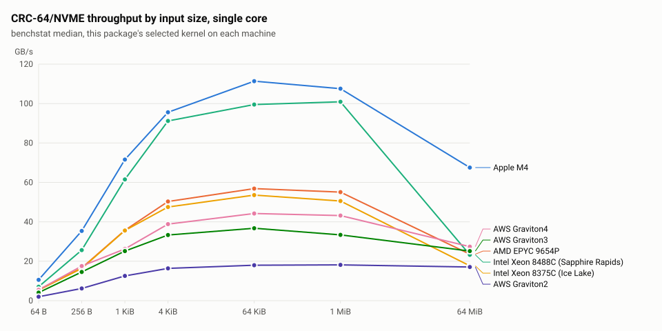

# crc64nvme

[](https://github.com/travcunn/crc64nvme/actions/workflows/ci.yml) [](https://pkg.go.dev/github.com/travcunn/crc64nvme)

Package crc64nvme computes CRC-64/NVME, the checksum defined by the NVMe specification and used by Amazon S3 as CRC64NVME.
It has the same API shape as `hash/crc64`, with carry-less-multiply kernels for amd64 and arm64 selected at init and a pure-Go fallback for everything else.
Measured on seven machines, it runs at 107.5 GB/s on an Apple M4 and 100.9 GB/s on an Intel Xeon Platinum 8488C (Sapphire Rapids) at 1 MiB, single core.

It is an independent implementation written from the public specification and the Intel folding paper, licensed Apache 2.0, with no dependency other than `golang.org/x/sys/cpu`.

## Install

```sh
go get github.com/travcunn/crc64nvme
```

Requires Go 1.25 or newer.

## Usage

Checksum a byte slice in one call:

```go
sum := crc64nvme.Checksum([]byte("123456789")) // 0xae8b14860a799888, the CRC-64/NVME check value
```

Stream a reader through the `hash.Hash64` returned by `New`:

```go
h := crc64nvme.New()
if _, err := io.Copy(h, f); err != nil {
	return err
}
sum := h.Sum64()  // as a uint64
raw := h.Sum(nil) // as 8 big-endian bytes
```

Continue a checksum across separate buffers with `Update`:

```go
crc := crc64nvme.Checksum(part1)
crc = crc64nvme.Update(crc, part2) // equals Checksum of part1 followed by part2
```

The digest returned by `New` implements `encoding.BinaryMarshaler`, `encoding.BinaryAppender` and `encoding.BinaryUnmarshaler`, so a partial checksum can be saved and resumed.

## Performance

All numbers are single-core throughput in GB/s (10^9 bytes per second, higher is better), measured on 2026-10-03 with Go 1.26.4 using `go test -bench` and the benchstat median.
The Apple M4 (macOS 26.2, performance core, measured clock 4.35 GHz) and the AMD EPYC 9654P (Zen 4, Linux, 32-vCPU VM, measured clock 3.64 GHz) were shared with other work during the runs.
On those two machines Tables A and B are the median of 10 runs, with the 1-minute load average at 2.4 at the start and 2.5 at the end on the M4, and 9.3 and 4.6 on the EPYC.
Their rows in Tables C and D are the median of 5 runs with load averages of 2.4 to 2.5 on the M4 and 3.2 to 4.1 on the EPYC.
The other five machines are AWS EC2 instances in us-west-2 running Amazon Linux 2023: an Intel Xeon Platinum 8488C (Sapphire Rapids, c7i.2xlarge), an Intel Xeon Platinum 8375C (Ice Lake, c6i.2xlarge), and AWS Graviton4 (Neoverse V2, c8g.xlarge), Graviton3 (Neoverse V1, c7g.large) and Graviton2 (Neoverse N1, c6g.large).
Each ran its benchmarks alone on its own instance, in one session per machine, and every figure from them is the median of 5 runs.
The Graviton2 and Graviton3 instances have 2 vCPUs.
The Sapphire Rapids, Ice Lake and Graviton4 runs include the kernel loop alignment added after v0.1.0, and the other four do not.
Tables A and B for a machine come from the same `go test` invocation.

<picture>
  <source media="(prefers-color-scheme: dark)" srcset="docs/throughput-dark.svg">
  
</picture>

The chart shows the throughput of each machine's selected kernel against input size, with sizes on a log scale. It plots the same medians as Table A.

**Table A. Selected kernel, GB/s by input size**

| Machine                            | 64 B | 256 B | 1 KiB | 4 KiB | 64 KiB | 1 MiB | 64 MiB | Kernel |
|------------------------------------|-----:|------:|------:|------:|-------:|------:|-------:|--------|
| Apple M4                           | 10.6 |  35.4 |  71.6 |  95.6 |  111.4 | 107.5 |   67.5 | pmull  |
| AMD EPYC 9654P                     |  5.4 |  16.6 |  35.7 |  50.3 |   56.9 |  55.1 |   23.6 | avx512 |
| Intel Xeon 8488C (Sapphire Rapids) |  7.1 |  25.7 |  61.5 |  91.2 |   99.5 | 100.9 |   23.3 | avx512 |
| Intel Xeon 8375C (Ice Lake)        |  5.3 |  16.3 |  35.6 |  47.5 |   53.6 |  50.5 |   17.7 | avx512 |
| AWS Graviton4                      |  5.5 |  17.6 |  26.2 |  38.8 |   44.2 |  43.2 |   27.4 | eor3   |
| AWS Graviton3                      |  4.1 |  14.6 |  25.1 |  33.3 |   36.7 |  33.4 |   25.2 | eor3   |
| AWS Graviton2                      |  2.0 |   6.2 |  12.6 |  16.4 |   18.0 |  18.2 |   17.1 | pmull  |

On the three AVX-512 machines the 64 B column runs the avx2 kernel (see [How a kernel is chosen](#how-a-kernel-is-chosen)).

**Table B. Go hash/crc64 on the same machines**

| Machine                            | 64 B | 256 B | 1 KiB | 4 KiB | 64 KiB | 1 MiB | 64 MiB |
|------------------------------------|-----:|------:|------:|------:|-------:|------:|-------:|
| Apple M4                           |  0.8 |   0.6 |   0.5 |   1.5 |    2.1 |   2.2 |    2.2 |
| AMD EPYC 9654P                     |  0.5 |   0.5 |   0.5 |   1.1 |    1.8 |   1.8 |    1.9 |
| Intel Xeon 8488C (Sapphire Rapids) |  0.5 |   0.4 |   0.4 |   1.1 |    1.6 |   1.7 |    1.7 |
| Intel Xeon 8375C (Ice Lake)        |  0.5 |   0.4 |   0.4 |   1.1 |    1.7 |   1.7 |    1.7 |
| AWS Graviton4                      |  0.5 |   0.4 |   0.4 |   1.0 |    1.5 |   1.6 |    1.6 |
| AWS Graviton3                      |  0.4 |   0.4 |   0.4 |   0.9 |    1.4 |   1.4 |    1.4 |
| AWS Graviton2                      |  0.3 |   0.3 |   0.4 |   0.7 |    1.2 |   1.3 |    1.2 |

**Table C. Per-kernel throughput at 4 KiB and 1 MiB**

Each kernel the machine can run is forced in turn with `BenchmarkTiers` in the root package.

| Machine                            | Kernel  | 4 KiB | 1 MiB |
|------------------------------------|---------|------:|------:|
| Apple M4                           | generic |   2.2 |   2.2 |
| Apple M4                           | eor3    |  69.6 |  81.2 |
| Apple M4                           | pmull   |  95.8 | 110.3 |
| AMD EPYC 9654P                     | generic |   1.9 |   1.9 |
| AMD EPYC 9654P                     | sse     |  13.8 |  13.8 |
| AMD EPYC 9654P                     | avx2    |  26.7 |  27.8 |
| AMD EPYC 9654P                     | avx512  |  50.1 |  54.6 |
| Intel Xeon 8488C (Sapphire Rapids) | generic |   1.7 |   1.7 |
| Intel Xeon 8488C (Sapphire Rapids) | sse     |  26.0 |  26.1 |
| Intel Xeon 8488C (Sapphire Rapids) | avx2    |  51.2 |  52.1 |
| Intel Xeon 8488C (Sapphire Rapids) | avx512  |  91.1 |  88.5 |
| Intel Xeon 8375C (Ice Lake)        | generic |   1.7 |   1.7 |
| Intel Xeon 8375C (Ice Lake)        | sse     |  26.4 |  27.5 |
| Intel Xeon 8375C (Ice Lake)        | avx2    |  26.1 |  27.8 |
| Intel Xeon 8375C (Ice Lake)        | avx512  |  47.8 |  52.8 |
| AWS Graviton4                      | generic |   1.5 |   1.5 |
| AWS Graviton4                      | pmull   |  28.8 |  24.1 |
| AWS Graviton4                      | eor3    |  39.3 |  43.1 |
| AWS Graviton3                      | generic |   1.5 |   1.4 |
| AWS Graviton3                      | pmull   |  23.8 |  21.7 |
| AWS Graviton3                      | eor3    |  33.6 |  34.0 |
| AWS Graviton2                      | generic |   1.3 |   1.3 |
| AWS Graviton2                      | pmull   |  16.8 |  18.2 |

The forced avx512 kernel's 1 MiB samples on the Sapphire Rapids Xeon fell into two groups, three near 88 GB/s and two near 101 GB/s, and the median comes from the lower group.
The selected kernel in Table A measured 100.9 GB/s at the same size on the same instance.

**Table D. How close to the hardware limit**

The bound is the issue rate of the main loop's busiest execution port, at the machine's clock.
The M4 and EPYC clocks were measured with a dependent-instruction chain, the Xeon clocks are the `cpu MHz` value in `/proc/cpuinfo` recorded in each results file, and the Graviton clocks are the nominal AWS figures.
Each 16-byte lane costs two 64x64 multiplies per block.

| Machine                            | Kernel | Clock (GHz)   | Bound (B/cycle) | Bound (GB/s) | Measured 1 MiB (GB/s) | Of bound |
|------------------------------------|--------|---------------|----------------:|-------------:|----------------------:|---------:|
| Apple M4                           | pmull  | 4.35          |            32.0 |        139.2 |                 110.3 |      79% |
| Apple M4                           | eor3   | 4.35          |            21.3 |         92.8 |                  81.2 |      88% |
| AMD EPYC 9654P                     | sse    | 3.64          |             4.0 |         14.6 |                  13.8 |      94% |
| AMD EPYC 9654P                     | avx2   | 3.64          |             8.0 |         29.1 |                  27.8 |      95% |
| AMD EPYC 9654P                     | avx512 | 3.64          |            16.0 |         58.2 |                  54.6 |      94% |
| Intel Xeon 8488C (Sapphire Rapids) | sse    | 3.3           |             8.0 |         26.4 |                  26.1 |      99% |
| Intel Xeon 8488C (Sapphire Rapids) | avx2   | 3.3           |            16.0 |         52.8 |                  52.1 |      99% |
| Intel Xeon 8488C (Sapphire Rapids) | avx512 | 3.3           |            32.0 |        105.6 |                  88.5 |      84% |
| Intel Xeon 8375C (Ice Lake)        | sse    | 3.5           |             8.0 |         28.0 |                  27.5 |      98% |
| Intel Xeon 8375C (Ice Lake)        | avx2   | 3.5           |             8.0 |         28.0 |                  27.8 |      99% |
| Intel Xeon 8375C (Ice Lake)        | avx512 | 3.5           |            16.0 |         56.0 |                  52.8 |      94% |
| AWS Graviton4                      | eor3   | 2.8 (nominal) |            16.0 |         44.8 |                  43.1 |      96% |
| AWS Graviton3                      | eor3   | 2.6 (nominal) |            16.0 |         41.6 |                  34.0 |      82% |
| AWS Graviton2                      | pmull  | 2.5 (nominal) |             8.0 |         20.0 |                  18.2 |      91% |

Zen 4 issues PCLMULQDQ at one per 2 cycles with 4-cycle latency for the xmm, ymm and zmm forms alike [6].
A zmm multiply covers four lanes where a ymm multiply covers two, so the AVX-512 bound is twice the AVX2 bound.
Ice Lake issues the xmm form once per cycle and the ymm and zmm forms once per 2 cycles [6].
The ymm form there costs two cycles like the zmm form, so avx2 gains nothing over sse and avx512 is the only step up.
uops.info has no Sapphire Rapids entry.
On Emerald Rapids, which uses a closely related core, every width issues once per cycle [6], and the Sapphire Rapids sse and avx2 rows above reach 99% of that bound.
With every width at one per cycle, Sapphire Rapids leads the x86 results.
Apple cores issue PMULL and PMULL2 on four SIMD pipes with 3-cycle latency, and EOR3 on the same pipes [8].
They also fuse a PMULL with an EOR into the same register into one micro-op [8].
The pmull kernel's main loop pairs every multiply that way, which makes a lane cost 2 micro-ops against 3 for the eor3 kernel (PMULL, PMULL2, EOR3).
On four pipes that is 16 micro-ops (4 cycles) per 128 bytes for pmull and 24 (6 cycles) for eor3.
The Apple bounds use Firestorm data, the closest published measurements for the M4.
Neoverse V1 and V2 issue the 64-bit PMULL on any of their four SIMD pipes but EOR3 on one pipe only [9, 10].
The eor3 kernel's 8 EOR3 per 128 bytes then take 8 cycles, which is 16 B/cycle.
Neoverse N1 issues PMULL on one pipe only [9, 10], so the 16 multiplies per 128 bytes of the pmull kernel take 16 cycles, which is 8 B/cycle.

At 64 MiB the input no longer fits in cache.
Every machine except Graviton2 drops well below its 1 MiB figure there, limited by memory bandwidth rather than by the kernel.

Reproduce the per-kernel numbers from the repository root:

```sh
go test -run xxx -bench Tiers -count 10 . | benchstat -
```

Regenerate the chart from the committed results files:

```sh
go run ./internal/benchchart -out docs \
	"Apple M4=bench/results/m4.txt" \
	"AMD EPYC 9654P=bench/results/epyc9654p.txt" \
	"Intel Xeon 8488C (Sapphire Rapids)=bench/results/sapphirerapids8488c.txt" \
	"Intel Xeon 8375C (Ice Lake)=bench/results/icelake8375c.txt" \
	"AWS Graviton4=bench/results/graviton4.txt" \
	"AWS Graviton3=bench/results/graviton3.txt" \
	"AWS Graviton2=bench/results/graviton2.txt"
```

## How a kernel is chosen

At init the package reads the CPU features through `golang.org/x/sys/cpu` and selects one kernel.
Kernels process whole 16-byte chunks. The last 0 to 15 bytes, and inputs under 16 bytes, go through the generic code.

| Kernel  | Arch  | CPU features required         | Block per iteration | Accumulators | Notes                                                                                                                                                                                                                |
|---------|-------|-------------------------------|--------------------:|-------------:|----------------------------------------------------------------------------------------------------------------------------------------------------------------------------------------------------------------------|
| generic | any   | none                          |                 8 B |          n/a | Slicing-by-8 for inputs of 64 bytes or more, a byte table below that. The only path with `-tags purego` or on other architectures.                                                                                   |
| sse     | amd64 | SSE4.1, PCLMULQDQ             |               128 B |        8 xmm |                                                                                                                                                                                                                      |
| avx2    | amd64 | AVX2, PCLMULQDQ, VPCLMULQDQ   |               256 B |        8 ymm | VPCLMULQDQ is read from CPUID directly so the VEX-256 form is found on CPUs without AVX-512, such as Zen 3.                                                                                                          |
| avx512  | amd64 | AVX512F, AVX512VL, VPCLMULQDQ |               256 B |        4 zmm | Used for inputs of 256 bytes or more. Shorter inputs use avx2.                                                                                                                                                       |
| pmull   | arm64 | PMULL                         |               256 B |           16 | Preferred on macOS and iOS because Apple cores fuse PMULL with EOR. Remainders of 128 to 255 bytes run an 8-lane loop.                                                                                               |
| eor3    | arm64 | PMULL, SHA3                   |               128 B |            8 | Preferred on other operating systems when SHA3 is present. Measured 1.4x pmull at 4 KiB and 1.6x to 1.8x at 1 MiB on Graviton3 and Graviton4 (Neoverse V1 and V2), so the preference on non-Apple cores is measured. |

Each zmm, ymm or xmm accumulator holds four, two or one 16-byte lanes, so every SIMD kernel keeps 8 or 16 lanes in flight.
`x/sys/cpu` does not expose the arm64 implementer, so the operating system stands in for "Apple core".
Asahi Linux on Apple silicon therefore gets eor3, which is correct and slower.

The 256-byte threshold for avx512 is the AVX-512 block size.
On Zen 4 the avx512 kernel measured faster than avx2 at every size from 256 bytes up.
On the Ice Lake and Sapphire Rapids Xeons it measured faster than avx2 at every size `BenchmarkTiers` covers, from 64 bytes to 64 MiB.

Building with `-tags purego` removes all assembly and uses the generic kernel everywhere.

## Design

**Folding.**
Each 16-byte lane of input is a 128-bit polynomial.
Moving a lane forward by `d` bytes multiplies it by x^(8d) mod P, and a fold constant is that multiplier split into the pair K(8d+63) and K(8d-1), where K(e) = bitrev64(x^e mod P).
The kernel multiplies the lane's low and high 64-bit halves by the pair, XORs the two 128-bit products, and XORs in the data that sits `d` bytes later.
The main loop does this once per lane per iteration, with `d` equal to the block size, so each iteration consumes one block.
The lanes are independent, so the multiplies for 8 or 16 lanes overlap in the pipeline.

```
  lane (16 B)                       fold constant pair for d bytes
  +-----------+-----------+         +-------------+-------------+
  |  lo  64b  |  hi  64b  |         |  K(8d+63)   |  K(8d-1)    |
  +-----+-----+-----+-----+         +------+------+------+------+
        |           |                      |             |
        +-------- clmul(lo, K(8d+63)) -----+             |
                    |                                    |
                    +------ clmul(hi, K(8d-1)) ----------+
                                     |
            128-bit product ^ 128-bit product ^ next 16 B of data at +d
                                     |
                                     v
                                 new lane
```

**Lane combination.**
After the last full block, lane `i` of `n` is `16*(n-1-i)` bytes ahead of the final lane.
Each earlier lane is folded by its own distance with the matching constant pair and XORed into the final lane, which leaves one 128-bit remainder.
Any whole 16-byte chunks left after the last block are folded into that remainder one at a time with the d = 16 pair.

**Barrett reduction.**
The 128-bit remainder is reduced to 64 bits with three carry-less multiplies: one by K(127) to fold the low half onto the high half, one by MU = x^128 div P to estimate the quotient, and one by P to subtract it.
The data is bit-reflected, so every value a step needs sits in the low or high 64-bit half of a product, and the reduction needs no shift instructions.
MU and P each have degree 64. The generator stores their 65-bit reflections truncated to 64 bits, and the dropped bit of P is restored by one extra XOR of the quotient estimate.

**Constants and proof.**
Every constant is derived from the polynomial by `internal/gen` and written to `internal/kconst` and `kconst_data.s`. None is typed by hand.
A bit-serial software model in `internal/model` performs the same folds and reduction with the same constants, and it is tested against `hash/crc64` for 8, 16 and 32 lanes before any assembly runs.
Every kernel is tested against the model at each 16-byte multiple up to 1024 bytes, and against `hash/crc64` at every size from 0 to 2048 bytes at 16 alignments, plus large and streaming cases.

## Correctness and testing

- The oracle is the standard library's `hash/crc64` with the CRC-64/NVME polynomial.
- Every size from 0 to 2048 bytes is checked at 16 buffer offsets with a random starting CRC, for every kernel the machine can run.
- Large inputs up to 64 MiB, including lengths that are not multiples of 16, are checked for every kernel.
- Streaming is checked with fixed chunk sizes around the 16, 128 and 256-byte boundaries and with 200 random split patterns.
- Each test forces every kernel available on the machine, and lowers the avx512 threshold so that kernel also sees short inputs.
- The fold and Barrett constants are recomputed in tests by independent code and compared with the generated tables.
- The avx512 kernel runs in CI only when the hosted runner has AVX-512. It was verified on an AMD EPYC 9654P and on the Ice Lake and Sapphire Rapids Xeons.
- The test suite was run and passed on all seven machines listed under [Performance](#performance). Graviton2 has PMULL without SHA3, so it exercises the pmull-only selection on real hardware.
- A CI job runs the arm64 tests under QEMU emulating a Cortex-A72, which has PMULL but no SHA3, to cover the pmull-only selection outside macOS.
- CI runs `go generate` and fails if the generated files differ from the committed ones.

## Sources

1. Intel, "Fast CRC Computation for Generic Polynomials Using PCLMULQDQ Instruction". <https://www.intel.com/content/dam/www/public/us/en/documents/white-papers/fast-crc-computation-generic-polynomials-pclmulqdq-paper.pdf> ([Wayback Machine copy](https://web.archive.org/web/20230315165408/https://www.intel.com/content/dam/www/public/us/en/documents/white-papers/fast-crc-computation-generic-polynomials-pclmulqdq-paper.pdf)). Folding and the reduction recipe.
2. NVM Express, NVM Command Set Specification. <https://nvmexpress.org/specifications/>. Definition of the 64-bit CRC.
3. Go standard library, `hash/crc64`. <https://pkg.go.dev/hash/crc64>. Test oracle and API shape.
4. Greg Cook, Catalogue of parametrised CRC algorithms, CRC-64/NVME entry. <https://reveng.sourceforge.io/crc-catalogue/all.htm#crc.cat.crc-64-nvme>. Parameters and check value.
5. P. Barrett, "Implementing the Rivest Shamir and Adleman Public Key Encryption Algorithm on a Standard Digital Signal Processor", CRYPTO '86. <https://link.springer.com/chapter/10.1007/3-540-47721-7_24>. Barrett reduction.
6. uops.info, Zen 4, Ice Lake and Emerald Rapids measurements for [PCLMULQDQ xmm](https://uops.info/html-instr/PCLMULQDQ_XMM_XMM_I8.html), [VPCLMULQDQ ymm](https://uops.info/html-instr/VPCLMULQDQ_YMM_YMM_YMM_I8.html) and [VPCLMULQDQ zmm](https://uops.info/html-instr/VPCLMULQDQ_ZMM_ZMM_ZMM_I8.html). <https://uops.info>. Latency and throughput for Table D.
7. Agner Fog, Instruction tables. <https://www.agner.org/optimize/instruction_tables.pdf>. Cross-check of x86 latencies.
8. Dougall Johnson, Apple Firestorm [SIMD instruction tables](https://dougallj.github.io/applecpu/firestorm-simd.html) and [microarchitecture notes, including instruction fusion](https://dougallj.github.io/applecpu/firestorm.html). PMULL and EOR3 throughput and PMULL+EOR fusion for Table D and the pmull kernel.
9. Arm, Neoverse N1, V1 and V2 Software Optimization Guides. <https://developer.arm.com/documentation>. Kernel choice on non-Apple arm64 cores.
10. LLVM AArch64 scheduling models for Neoverse N1, V1 and V2 (`AArch64SchedNeoverseN1.td`, `AArch64SchedNeoverseV1.td` and `AArch64SchedNeoverseV2.td` in llvm-project), derived from the Arm Software Optimization Guides. <https://github.com/llvm/llvm-project/tree/main/llvm/lib/Target/AArch64>. PMULL and EOR3 issue ports and latencies for Table D.
11. `golang.org/x/sys/cpu`. <https://pkg.go.dev/golang.org/x/sys/cpu>. CPU feature detection.
12. A Quick Guide to Go's Assembler. <https://go.dev/doc/asm>. Assembly conventions.

## License

Apache License 2.0. See [LICENSE](LICENSE).
